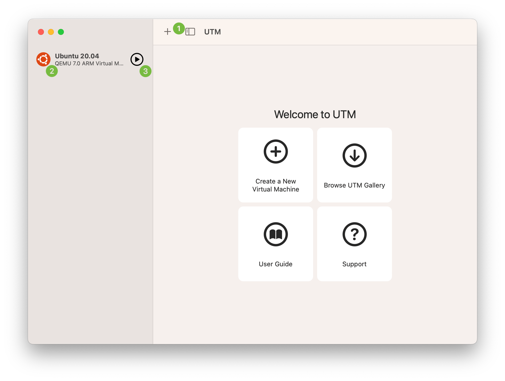
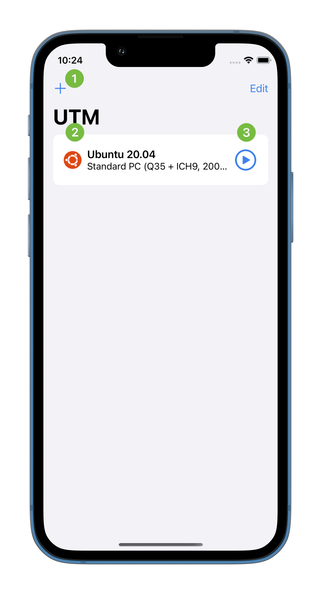
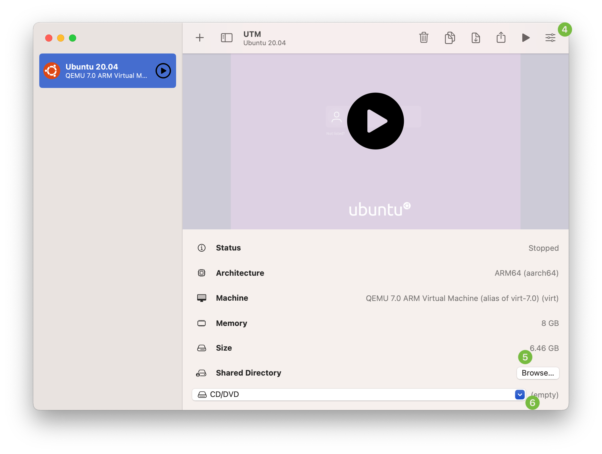
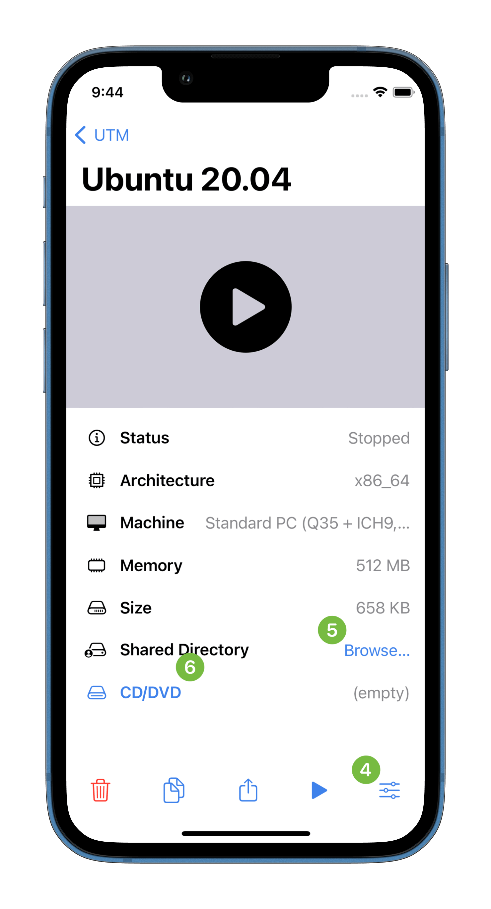

# Basics

1. Open the new virtual machine wizard with the "+" button.
2. Select a virtual machine to show its details. Secondary click or Force Touch a virtual machine to show the [actions menu](actions.md).
3. Quickly start a virtual machine with the start button.

4. Open the [settings](../settings-qemu/settings-qemu.md) with the rightmost toolbar icon.
5. Select a [shared directory](../guest-support/sharing/directory.md) by the "Browse..." button in the details view.
6. Select a removable disk image to mount (or eject) by opening the drive menu in the details view.
