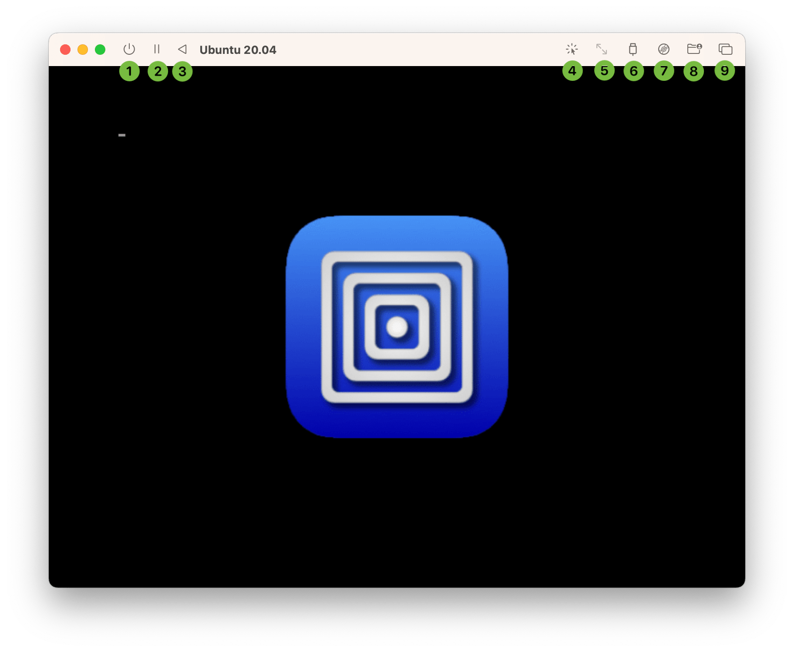
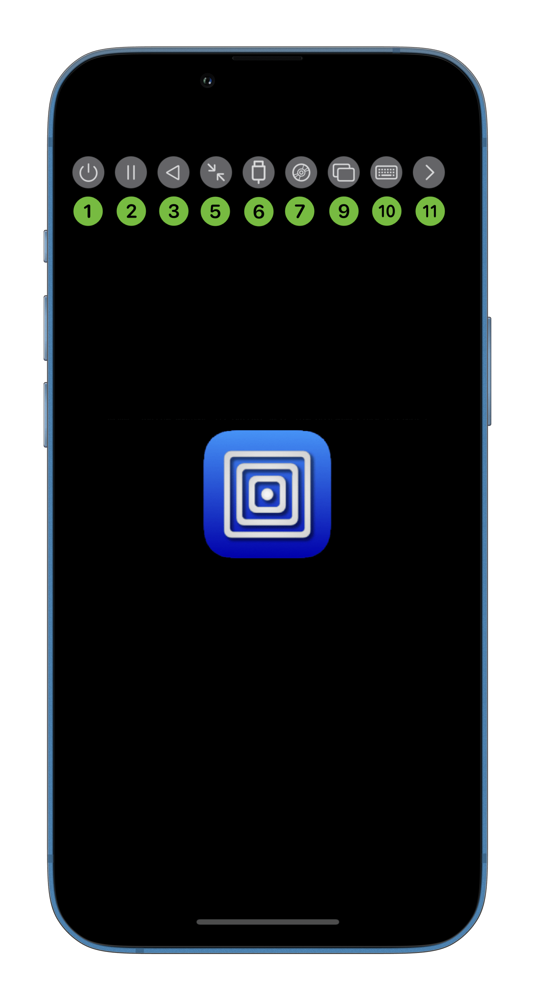

# Controls

1. Power off the virtual machine. This will discard any unsaved data. It is recommended that you shut down the virtual machine from the guest operating system. **macOS** You can long press on this button for additional power-down options:
    1. *Request power down*: Sends power down request to the guest. This simulates pressing the power button on a PC.
    2. *Force shut down*: Tells the VM process to shut down with risk of data corruption. This simulates holding down the power button on a PC. This is the default option.
    3. *Force kill*: Force kill the VM process with high risk of data corruption.
2. Suspend the virtual machine when supported.

> [!NOTE]
> The suspend feature will not work if any device that is in use does not support suspend. This typically includes emulated NVMe devices as well as GPU accelerated display cards. Additionally, QEMU hypervisor on Intel does not support suspend.

3. Reset the virtual machine. This will discard any unsaved data.
4. **macOS** Capture the cursor and keyboard for exclusive use by the virtual machine. This allows certain key combinations such as Cmd+Tab to be sent to the virtual machine. Once captured, the [key combination Control+Option](../preferences/macos.md#use-commandoption-for-input-capturerelease) can be used to release the capture. The same key combination can also be used to enter capture mode as well.
5. **iOS** When in graphical display mode, the first press will lock the display to fit. That means whenever the resolution changes, the display will scale accordingly so the entire screen is used. A second press will release the lock and set the display scaling to 1x. When in terminal display mode, a press will send the [resize command](../settings-qemu/devices/serial.md#resize-console-command). **macOS** This button is only enabled in terminal display mode and has the same behaviour as iOS.
6. USB devices that currently detected are listed and can be connected or disconnected. **iOS** Not all builds support this option. **macOS** Apple virtualization backend does not support this option. If unsupported or if [USB sharing is disabled](../settings-qemu/input.md#usb-sharing), this button will be disabled or missing.
7. When one or more [removable drives](../settings-qemu/drive/drive.md) are configured, you can change the mounted image in this menu. **iOS** You can also change the [shared directory](../settings-qemu/sharing.md) if using WebDAV. **macOS** You can also download and mount the [Windows guest tools](../guest-support/windows.md) in this menu. Apple virtualization backend does not support this option.
8. **macOS** The WebDAV [shared directory](../settings-qemu/sharing.md) can be selected and changed in this menu. Apple virtualization backend does not support this option.
9. Switch between [multiple displays](../advanced/multiple-displays.md) in this menu.
10. **iOS** Show or hide the on screen keyboard. You can also Force Touch this button to send a keyboard shortcut.
11. **iOS** Show or hide the other toolbar buttons. When the toolbar is hidden, this button will disappear when no touch event is detected for a long period of time. Tap the screen to reveal the button.
