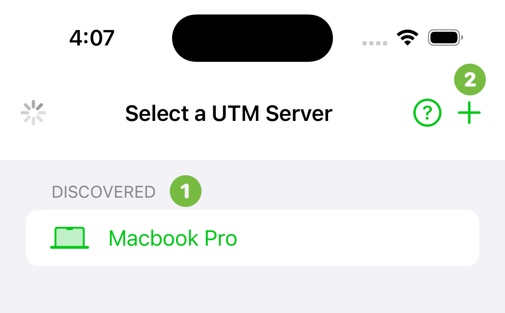
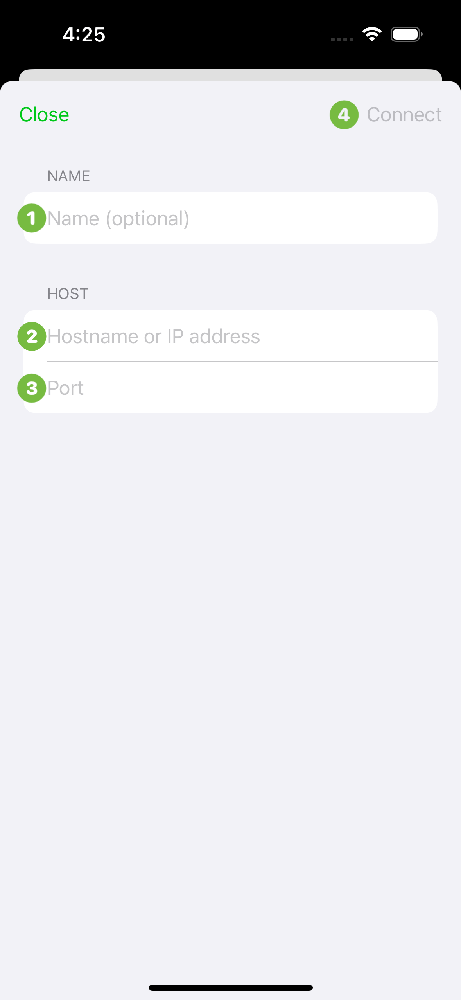
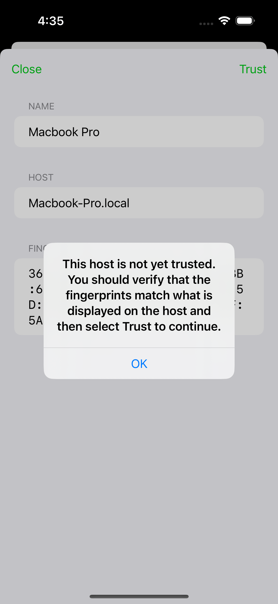

# Remote

UTM Remote is a client that connects to virtual machines running on a Mac, so you can use them from another device. It turns UTM Pro into a small Virtual Desktop Infrastructure (VDI) and lets you self-host a virtual machine for remote use.

> [!NOTE]
> This is not the same as managing a remote KVM host. That reaches virtual
> machines running on *another machine*; this shares the ones running on *this
> Mac*. For the former, see the [remote KVM guide](../../RemoteKVM.md).

## Getting the client
UTM Pro does not ship an iOS build. The client is upstream's UTM Remote, which speaks the same protocol and works against the server in UTM Pro.

[Download on the App Store](https://apps.apple.com/us/app/utm-remote-virtual-machines/id6470773592)

## Setup
The client needs UTM Pro running on a Mac. See the [server setup guide](server.md).

## Getting Started

1. Discovered and saved servers are listed here. UTM Pro Remote uses Bonjour to automatically discover UTM Pro server running on the same network.
2. Press the "New" button to manually add a server. This is used if you cannot use Bonjour or if the server is located outside of the local network. Note that UTM Pro server must be [configured to accept external clients](../preferences/macos.md#allow-access-from-external-clients) if this is the case.

1. The name to display in the server list. If left blank, the server list will use the host name instead. If the server was discovered, this will be pre-populated with the host name and can be changed.
2. Type in the host name, IPv4 address, or IPv6 address of the remote server. If the server was discovered, this field will not be modifiable.
3. Type in the port number that the server is listening on. UTM Pro server attempts to use UPnP and NAT-PMP to automatically configure your router when external clients are allowed. However, this may not work and will require manual port forwarding on your router. This field is not available if the server was discovered.
4. The Connect button will be disabled until all required fields are filled in.

## Pairing
Upon first connection, both the server and the client are presented with the fingerprint which **should match unless a third party is eavesdropping**.

> [!WARNING]
> Make sure you manually validate that the fingerprint matches what is displayed on the host running UTM Pro server before trusting the connection. A trusted server is able to read and write data on the remote client device.

Once you validated the fingerprint, press "Trust" to continue.

## Password
If the server requires a password, you will be prompted to enter the password. This password can be set in the [server's preferences](../preferences/macos.md#require-password). You can choose to save the password on the client to avoid having to enter it each time.

> [!WARNING]
> The password is only an additional safeguard that is sent after pairing succeeds. You should always verify the fingerprint before trusting a client or server because an eavesdropper that is trusted can steal the password.

## Usage
Once connected to a server, the interface is [similar to full UTM Pro](../basics/basics.md).
