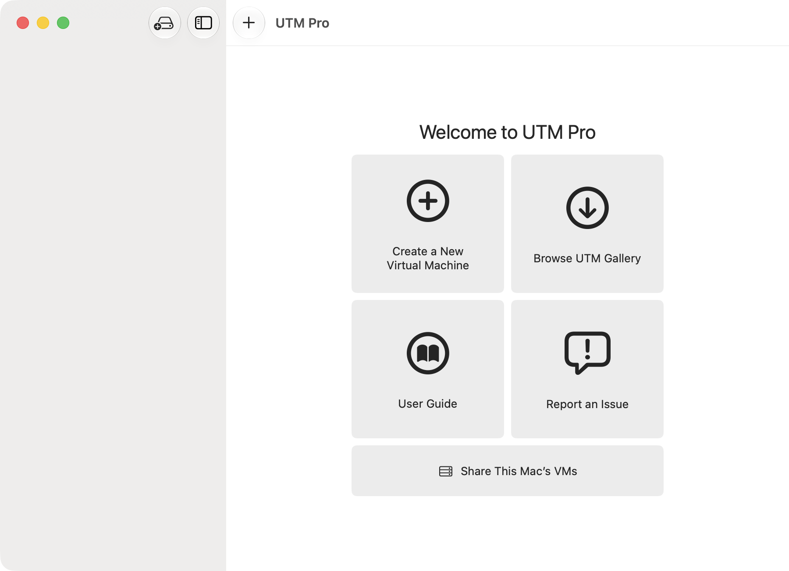
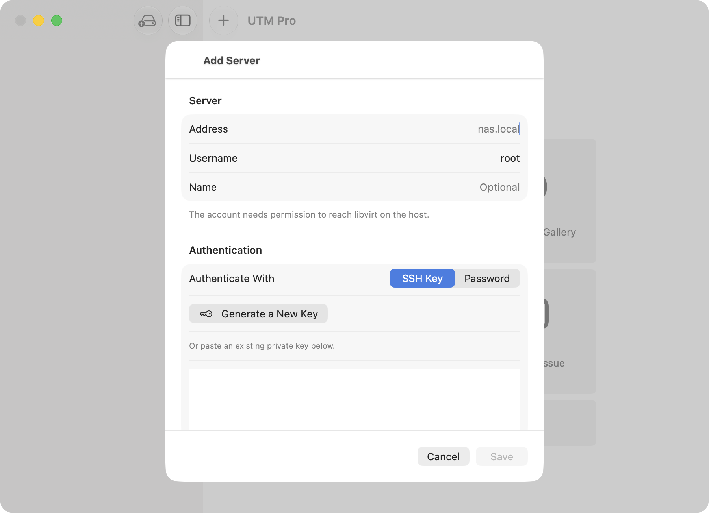
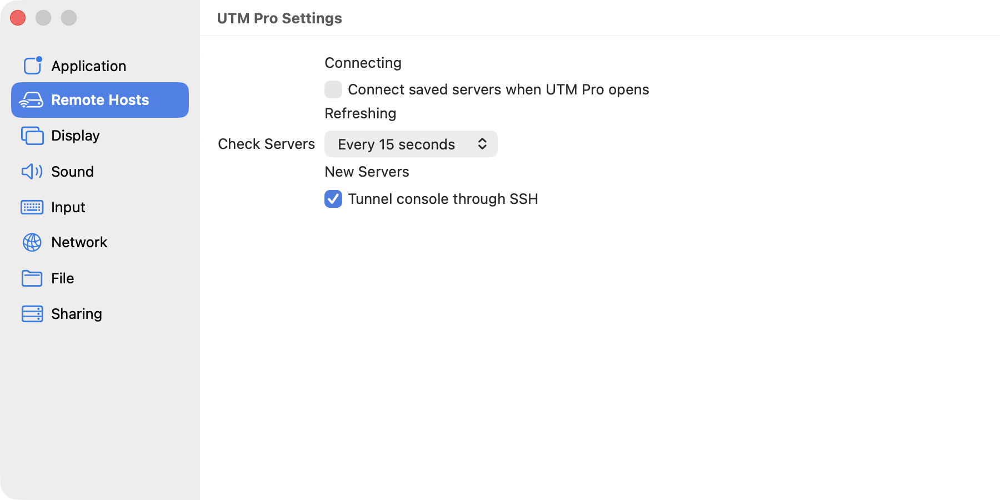

#  UTM Pro

> It is possible to invent a single machine which can be used to compute any computable sequence.

-- <cite>Alan Turing, 1936</cite>

UTM is a full featured system emulator and virtual machine host for iOS and macOS. It is based off of QEMU. In short, it allows you to run Windows, Linux, and more on your Mac, iPhone, and iPad. More information at https://getutm.app/ and https://mac.getutm.app/

**UTM Pro** is a fork of [UTM][6] that adds management of **remote libvirt/KVM hosts** alongside local virtual machines — built for driving an [OpenMediaVault][7] NAS running the `openmediavault-kvm` plugin from the same window as your local VMs. See [Remote KVM management](#remote-kvm-management) below.

<p align="center">
  
</p>

## Features

* Full system emulation (MMU, devices, etc) using QEMU
* 30+ processors supported including x86_64, ARM64, and RISC-V
* VGA graphics mode using SPICE and QXL
* Text terminal mode
* USB devices
* JIT based acceleration using QEMU TCG
* Frontend designed from scratch for macOS 11 and iOS 11+ using the latest and greatest APIs
* Create, manage, run VMs directly from your device

## Additional macOS Features

* Hardware accelerated virtualization using Hypervisor.framework and QEMU
* Boot macOS guests with Virtualization.framework on macOS 12+

## Remote KVM management

UTM Pro adds a second kind of virtual machine: one that runs on a remote
libvirt host rather than on your Mac. Remote VMs appear in the same sidebar as
local ones, grouped under the server they belong to.

* Manage libvirt/KVM hosts over SSH — no agent to install on the server
* Remote VMs appear in the sidebar grouped under their server, with live state
* Start, stop, reset, pause and resume; set autostart
* Consoles tunnelled through the SSH connection, using UTM's existing SPICE
  display, input, clipboard and USB redirection
* Edit a remote VM's memory, processors, name and notes — applied to the host
* Add disks from a storage pool, or attach a volume that already exists
* Create new VMs, with an installer ISO picked from a pool
* Storage management: pools with capacity, and volumes to create, resize,
  duplicate and delete
* Snapshots for both local **and** remote VMs: list, create, restore, delete
* Serial console over SSH for VMs with no graphics
* Duplicate and delete remote VMs, with or without their disks

### Requirements

The host needs `virsh` and `qemu-img` on the login account's `PATH`, and that
account must be able to reach libvirt (`qemu:///system` by default). Nothing
else is installed on the server.

### Authentication

<p align="center">
  
</p>

Servers authenticate with an **Ed25519** or **ECDSA** SSH key, or a password.
RSA keys are not supported — the SSH implementation UTM Pro uses does not
implement RSA at all. If that is all you have, use **Generate a New Key** in
the server form and install the public half on the host.

> When installing a generated key with `ssh-copy-id`, pass `-f`. Without it,
> `ssh-copy-id` decides whether the key is needed by logging in, so an existing
> key that already works makes it skip the new one and report success.

Host keys are pinned the first time you connect. A key that later changes stops
the connection and asks you to confirm, rather than reconnecting silently.

### Consoles

Remote consoles are tunnelled over SSH by default. This matters more than it
sounds: libvirt hosts commonly expose SPICE and VNC on `0.0.0.0` with no
password, so anyone who can reach the host can open a console. Tunnelling keeps
that traffic on the SSH connection. You can turn it off per server if the
console port is already protected.

VMs created by UTM Pro listen on the host's loopback only, for the same reason.

A console window is just a viewer. Closing it disconnects and leaves the VM
running — unlike a local VM, where the window owns the process.

### Serial consoles

A VM with no graphics has no SPICE console to show. Its serial port is a pty on
the host, so UTM Pro runs `virsh console` over the SSH connection and pipes it
into a terminal. Starting a headless remote VM opens this automatically.

### Snapshots

Snapshots now work for local VMs too, including while they are stopped —
previously UTM only kept a single implicit suspend snapshot, and deleting one
with the VM off silently did nothing.

Whether a snapshot captured memory is shown in the list, because it decides
what restoring does: resume mid-execution, or boot from that point.

Save and restore are also on the console window's toolbar, so you can take one
without leaving the guest.

### Settings

<p align="center">
  
</p>

Saved servers do not connect on launch — a stored credential is not a standing
instruction to log in. How often connected servers are re-read, and whether new
servers tunnel their console, are set here rather than compiled in.

## UTM SE

UTM/QEMU requires dynamic code generation (JIT) for maximum performance. JIT on iOS devices require either a jailbroken device, or one of the various workarounds found for specific versions of iOS (see "Install" for more details).

UTM SE ("slow edition") uses a [threaded interpreter][3] which performs better than a traditional interpreter but still slower than JIT. This technique is similar to what [iSH][4] does for dynamic execution. As a result, UTM SE does not require jailbreaking or any JIT workarounds and can be sideloaded as a regular app.

To optimize for size and build times, only the following architectures are included in UTM SE: ARM, PPC, RISC-V, and x86 (all with both 32-bit and 64-bit variants).

## Install

Builds are attached to each [release][8] as a downloadable asset. They are
unsigned, so macOS Gatekeeper will refuse the first launch: right-click the app
and choose Open, or clear the quarantine attribute.

## Documentation

The **[User Guide](Documentation/Guide/README.md)** covers both halves of the
app: the pages on [remote hosts](Documentation/Guide/remote-hosts/remote-hosts.md),
[snapshots](Documentation/Guide/remote-hosts/snapshots.md) and
[storage](Documentation/Guide/remote-hosts/storage.md) describe what this fork
adds, and the rest is adapted from the UTM documentation so that everything is
in one place.

## Development

### [macOS Development](Documentation/MacDevelopment.md)

### [iOS Development](Documentation/iOSDevelopment.md)

### [Remote KVM architecture](Documentation/RemoteKVM.md)

The remote management code lives in a self-contained Swift package,
`Packages/LibvirtKit`, which has no dependency on the app. It can be built and
tested on its own:

```sh
cd Packages/LibvirtKit
swift test
```

It also ships `libvirtprobe`, a read-only command line harness for checking a
host without going through the app:

```sh
LIBVIRT_SSH_KEY_FILE=~/.ssh/id_ed25519 swift run libvirtprobe root@my-nas.lan
```

## Related

* [iSH][4]: emulates a usermode Linux terminal interface for running x86 Linux applications on iOS
* [a-shell][5]: packages common Unix commands and utilities built natively for iOS and accessible through a terminal interface

## License

UTM is distributed under the permissive Apache 2.0 license. However, it uses several (L)GPL components. Most are dynamically linked but the gstreamer plugins are statically linked and parts of the code are taken from qemu. Please be aware of this if you intend on redistributing this application.

Some icons made by [Freepik](https://www.freepik.com) from [www.flaticon.com](https://www.flaticon.com/).

Additionally, UTM frontend depends on the following MIT/BSD License components:

* [IQKeyboardManager](https://github.com/hackiftekhar/IQKeyboardManager)
* [SwiftTerm](https://github.com/migueldeicaza/SwiftTerm)
* [ZIP Foundation](https://github.com/weichsel/ZIPFoundation)
* [InAppSettingsKit](https://github.com/futuretap/InAppSettingsKit)

Continuous integration hosting is provided by [MacStadium](https://www.macstadium.com/opensource)

[](https://www.macstadium.com)

  [1]: https://github.com/utmapp/UTM/actions?query=event%3Arelease+workflow%3ABuild
  [2]: Documentation/images/welcome.png
  [3]: https://github.com/ktemkin/qemu/blob/with_tcti/tcg/aarch64-tcti/README.md
  [4]: https://github.com/ish-app/ish
  [5]: https://github.com/holzschu/a-shell
  [6]: https://github.com/utmapp/UTM
  [7]: https://www.openmediavault.org/
  [8]: https://github.com/mbgroen/UTM-Pro/releases
